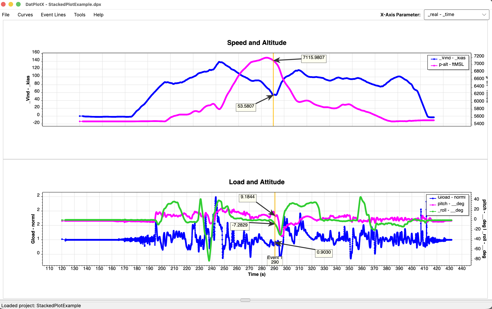
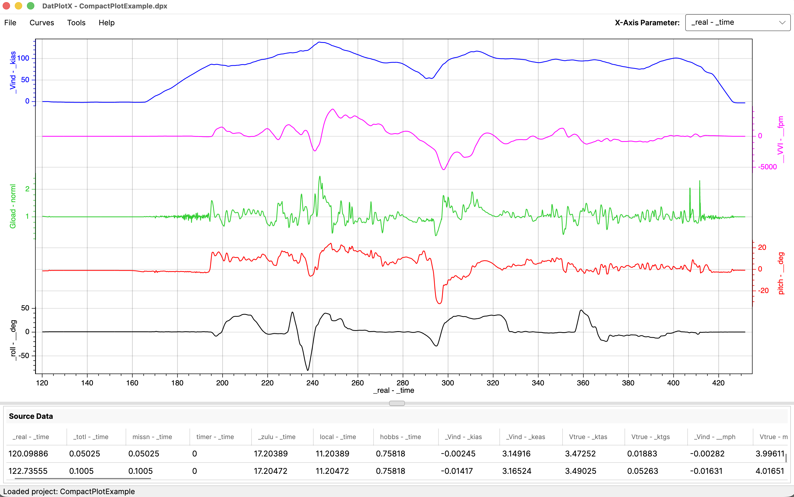
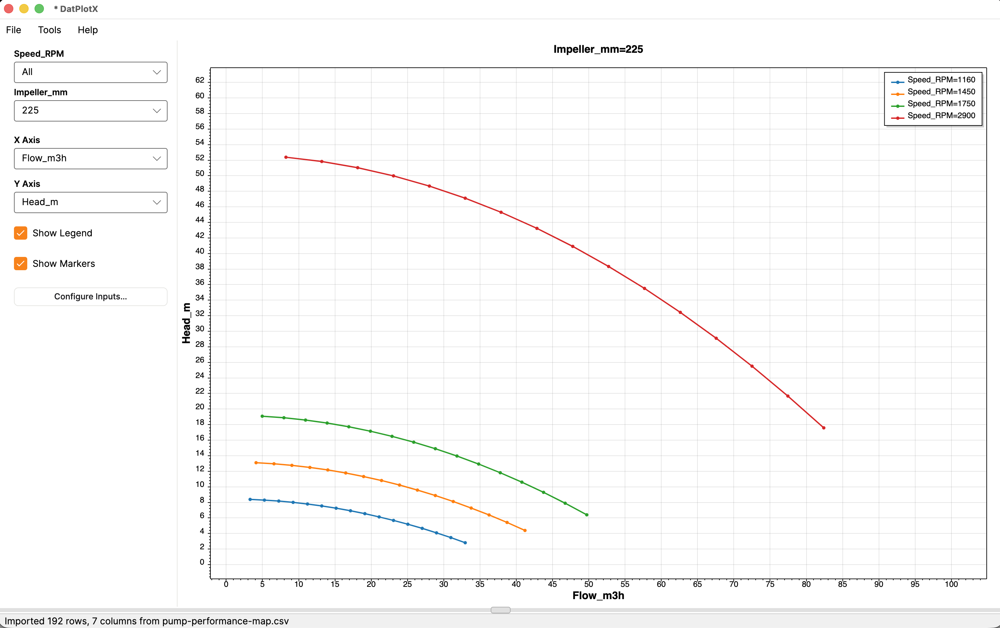
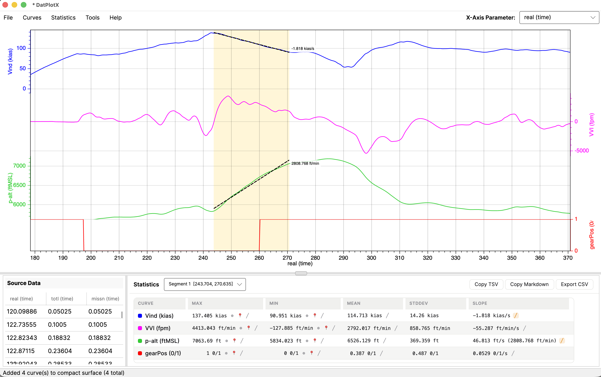
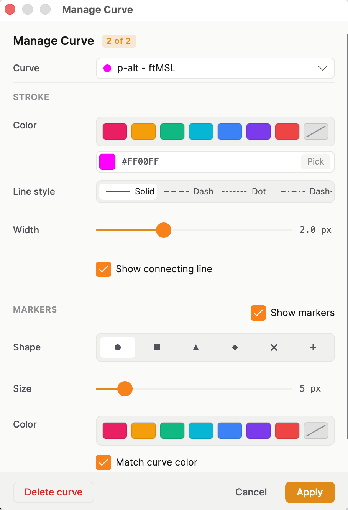

<div align="center">

# DatPlotX

**Scientific time-series visualization, built for engineers.**

[](https://github.com/aeroperf/DatPlotX/actions/workflows/ci.yml)
[](LICENSE)
[](https://github.com/aeroperf/DatPlotX/releases)
[](#download)



</div>

DatPlotX is an opinionated cross-platform plotting application squarely focused on
engineering data — flight test, time-series, and parametric datasets. One CSV
import flow, **three ways to see the data**: stacked synchronized stripcharts,
dense banded-axis exhibits, and grouped parametric line plots. Free, open source,
and no account required.

---

## Plot modes

DatPlotX picks the right rendering model for the shape of your data. The mode is
chosen at project creation and locked for the life of the project.

| Stacked Panes | Compact Plot Surface | Grouped Parameter Plot |
|:---:|:---:|:---:|
|  |  |  |
| Synchronized multi-parameter stripcharts with a shared X-axis — event lines, callouts, statistics, annotations | Dense single-area exhibits with one banded Y-axis per curve — FDA / FDM (NTSB-style) flight data plots | One line per unique combination of input parameters — parametric arrays, lookup tables |
| *ScottPlot 5* | *OxyPlot 2* | *ScottPlot 5* |

> Try the modes yourself with the datasets in [`SampleData/`](SampleData/) — the
> Grouped screenshot above is the included pump performance map.

## Features

- **CSV / TSV import** with comment lines, configurable culture-aware parsing, and
  large-file handling (up to 1 GB / 10M rows / 5000 columns, configurable).
- **Curve analysis & statistics** — analysis segments, metrics, and a results panel
  (Stacked and Compact modes).
- **Event lines, callouts, and annotations** (text + arrow), persisted per project.
- **Image export** — PNG / JPEG / SVG.
- **Local-only observability** — rolling file logs and opt-in local crash dumps.
  Nothing is ever uploaded (see [Docs/privacy.md](Docs/privacy.md) and
  [Docs/security-baseline.md](Docs/security-baseline.md)).
- **Native on Windows, macOS, and Linux** via Avalonia UI.

### Analysis & curve styling

| Curve analysis & statistics | Per-curve styling |
|:---:|:---:|
|  |  |
| Define analysis segments (Shift+drag, or snap to event lines) and get per-curve max / min / mean / std-dev / slope with slope overlays on the plot. Copy results as TSV or Markdown, or export CSV. | Color, line style, width, and marker shape per curve via the Manage Curve dialog. |

## Download

Download a self-contained build for your platform from the
**[Releases page](https://github.com/aeroperf/DatPlotX/releases)** —
`win-x64`, `osx-arm64`, and `linux-x64`. No runtime install required.

Builds are **not code-signed**. Windows and macOS will warn on first launch —
this is expected for unsigned community software, not a sign of tampering.
One-time steps below.

### macOS: "DatPlotX can't be opened" / "unidentified developer"

Gatekeeper blocks unsigned apps by default. Clear the quarantine flag once, after unzipping and moving `DatPlotX.app` to the Applications folder:

```bash
xattr -cr /Applications/DatPlotX.app
```

Then open normally. Alternative: right-click the app, select **Open**, then confirm
**Open** in the dialog — this works without a terminal.

### Windows: "Windows protected your PC" (SmartScreen)

Click **More info**, then **Run anyway**. This appears once per release build and does
not reappear after that version has been run.

### Linux

No OS-level signing gate — the binary runs as downloaded. Use `chmod +x` if the
execute bit isn't set.

## Build from source

DatPlotX targets **.NET 10**. Install the [.NET 10 SDK](https://dotnet.microsoft.com/download),
then:

```bash
git clone https://github.com/aeroperf/DatPlotX.git
cd DatPlotX

# Build
dotnet build DatPlotX/DatPlotX.csproj

# Run
dotnet run --project DatPlotX

# Test
dotnet test DatPlotX.Tests/DatPlotX.Tests.csproj
```

## 30-second quickstart

1. Launch DatPlotX and choose **New Project** → pick a plot mode.
2. **Import** a CSV/TSV file.
3. Open **Add Curves**, pick a Y parameter and axis, click **Plot Curve**.
4. Pan/zoom, drop event lines, add annotations, and **Export** an image when done.

## Documentation

- [User-facing docs & What's New](Docs/)
- [Security baseline](Docs/security-baseline.md)
- [Privacy (what logging/crash dumps collect)](Docs/privacy.md)
- [Contributing](CONTRIBUTING.md) · [Security policy](SECURITY.md)

## Contributing

Contributions are welcome. Please read **[CONTRIBUTING.md](CONTRIBUTING.md)** first
— it covers the build/test setup and MVVM conventions. There's no CLA: your
contributions are simply licensed under the same MIT terms as the project.

## License

DatPlotX is licensed under the **[MIT License](LICENSE)** — use it however you
like, including in commercial and closed-source projects.

Copyright © 2026 AeroPerf. Third-party components retain their own licenses.
